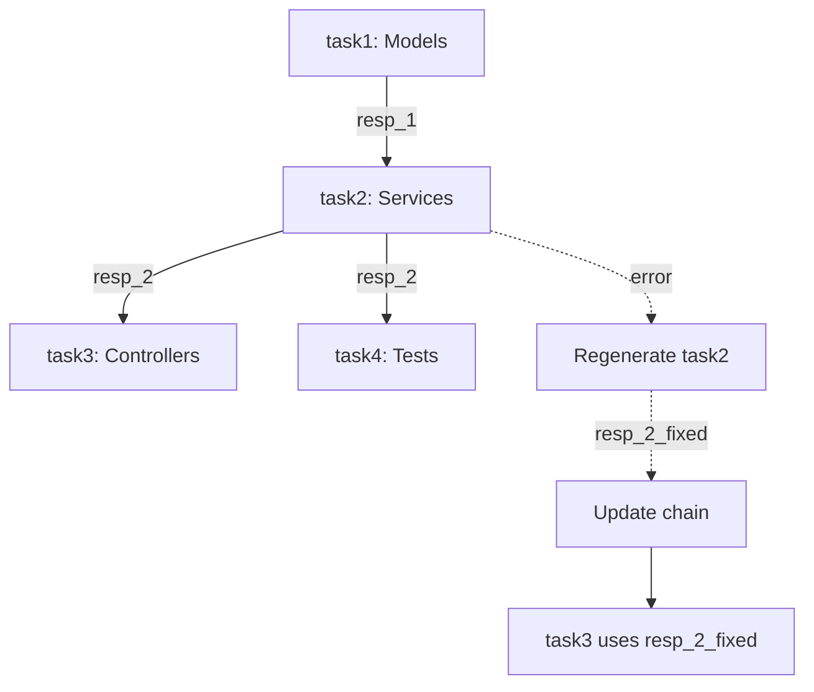
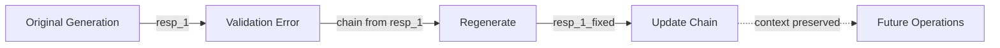

# OpenAI API Migration Documentation

## Overview

This document describes the migration from the OpenAI Chat Completions API to the OpenAI Responses API with gpt-5.1-codex model for improved code generation with response chaining.

## Migration Summary

**Date:** Current  
**Scope:** All code generation operations in `OpenAIService` and related partial classes  
**Primary Benefit:** Context continuity through response chaining across dependent tasks

## API Changes

### Previous Implementation

**Endpoint:** `/v1/chat/completions`  
**Model:** `gpt-4` or `gpt-3.5-turbo`  
**Behavior:** Each request was independent with no server-side storage or chaining

```csharp
// Old request structure
{
    "model": "gpt-4",
    "messages": [
        { "role": "system", "content": "..." },
        { "role": "user", "content": "..." }
    ]
}

// Old response structure
{
    "choices": [
        {
            "message": {
                "content": "generated code..."
            }
        }
    ]
}
```

### Current Implementation

**Endpoint:** `/v1/responses`  
**Model:** `gpt-5.1-codex`  
**Behavior:** Responses are stored server-side and can be chained via `previous_response_id`

```csharp
// New request structure
{
    "model": "gpt-5.1-codex",
    "store": true,
    "previous_response_id": "resp_abc123",  // Optional
    "input": [
        { "role": "system", "content": "..." },
        { "role": "user", "content": "..." }
    ]
}

// New response structure
{
    "id": "resp_abc123",
    "output": [
        {
            "type": "message",
            "role": "assistant",
            "content": [
                { "type": "output_text", "text": "generated code..." }
            ]
        }
    ]
}
```

## Code Changes

### 1. OpenAIService.cs

**Added:**
- `CodexResponse`, `CodexOutputItem`, `CodexContentPart`, `CodexError` models
- `_responseChain` dictionary to track response IDs by task ID
- `CallCodexResponsesAsync()` method with chaining support
- 300-second timeout configuration

**Removed:**
- `CallCodeGenChatCompletionAsync()` method
- `ChatCompletionResponse` parsing logic for code generation

**Modified:**
- HttpClient configuration to include `Timeout = TimeSpan.FromSeconds(300)`

### 2. OpenAIService.CodeGeneration.cs

**Modified:**
- `GenerateCodeAsync()`: Now calls `CallCodexResponsesAsync()` and stores response IDs
- `RegenerateCodeWithErrorsAsync()`: Chains from task's previous response ID
- Both methods now return and store response IDs for future chaining

**Chain Logic:**
```csharp
// Initial generation: chain from last dependency
string? previousResponseId = null;
if (task.Dependencies.Any())
{
    var lastDep = task.Dependencies.LastOrDefault(depId => _responseChain.ContainsKey(depId));
    if (lastDep != null)
    {
        previousResponseId = _responseChain[lastDep];
    }
}

// Store response for this task
var (responseId, generatedCode) = await CallCodexResponsesAsync(messages, previousResponseId);
_responseChain[task.Id] = responseId;
```

### 3. OpenAIService.ContractAware.cs

**Modified:**
- `GenerateCodeWithContractsAsync()`: Chains from dependency responses
- `RegenerateCodeWithContractFeedbackAsync()`: Maintains context through regeneration
- Contract violation iterations now update the chain with each attempt

## Response Chaining Strategy

### Task Dependency Chain



### Regeneration Chain



## Benefits

### 1. Context Continuity
- Dependent tasks automatically inherit context from dependencies
- Model understands relationships between generated files
- Reduced type mismatches across namespaces

### 2. Improved Error Correction
- Regeneration maintains original intent
- Surgical fixes instead of complete rewrites
- Better understanding of why errors occurred

### 3. Contract Compliance
- Contract-aware generation chains contract definitions
- Violation feedback maintains contract context
- Reduced signature mismatches

### 4. Reduced API Costs
- Implicit context transfer via chaining reduces prompt size
- Model has full history without re-sending all context
- More efficient token usage

## Configuration

### appsettings.json

```json
{
  "OpenAI": {
    "ApiKey": "your-api-key",
    "Model": "gpt-5.1"  // For task decomposition
  }
}
```

**Note:** The `gpt-5.1-codex` model is hardcoded for code generation operations.

### HttpClient Configuration

```csharp
private static readonly HttpClient _sharedCodeGenHttpClient = new HttpClient
{
    BaseAddress = new Uri("https://api.openai.com/v1/"),
    Timeout = TimeSpan.FromSeconds(300)  // 5 minutes for complex code
};
```

## Testing Recommendations

### 1. Verify Response Chaining
```csharp
// Generate code with dependencies
var task1 = await service.GenerateCodeAsync(task1Node, completedTasks);
var task2 = await service.GenerateCodeAsync(task2Node, completedTasks);

// Verify task2 chains from task1
Assert.True(service._responseChain.ContainsKey(task1.Id));
Assert.True(service._responseChain.ContainsKey(task2.Id));
```

### 2. Verify Context Continuity
Generate dependent tasks and verify:
- Type references are consistent
- Namespace usage is coherent
- Interface implementations match definitions

### 3. Verify Regeneration Chaining
```csharp
var original = await service.GenerateCodeAsync(task, completed);
var originalId = service._responseChain[task.Id];

var regenerated = await service.RegenerateCodeWithErrorsAsync(task, validationResult);
var newId = service._responseChain[task.Id];

Assert.NotEqual(originalId, newId);
// Verify regeneration maintains core structure
```

## Rollback Plan

If issues arise with the Responses API:

1. Revert to commit before migration
2. Restore `CallCodeGenChatCompletionAsync()` method
3. Update endpoint back to `chat/completions`
4. Remove `_responseChain` dictionary
5. Update documentation

## Performance Considerations

### Timeout
- 300-second timeout accommodates complex code generation
- Monitor for timeout patterns in production
- Consider increasing for very complex tasks

### Response Storage
- OpenAI stores responses server-side
- No local storage overhead
- Responses can be retrieved later if needed

### Retry Logic
- 3 retries with exponential backoff (unchanged)
- Handles transient API errors
- Response chain maintained across retries

## Monitoring

Track these metrics:

1. **Response Chain Length**: Average chain depth per project
2. **Regeneration Rate**: How often tasks are regenerated
3. **Context Effectiveness**: Type mismatch rate before/after migration
4. **API Latency**: Response times for chained vs unchained requests

## Documentation Updates

All documentation has been updated to reflect the new API:

- ? `OpenAIService.cs` - XML comments
- ? `OpenAIService.CodeGeneration.cs` - XML comments
- ? `OpenAIService.ContractAware.cs` - XML comments
- ? `Services/AI/README.md` - Comprehensive API documentation
- ? `src/AoTEngine/README.md` - Architecture highlights
- ? `OPENAI_API_MIGRATION.md` - This document

## Future Enhancements

### Potential Improvements

1. **Response Retrieval**: Implement method to retrieve stored responses by ID
2. **Chain Visualization**: Add logging to visualize response chains
3. **Chain Optimization**: Intelligently decide when to break chains
4. **Multi-Branch Chains**: Support branching for parallel task execution
5. **Chain Persistence**: Save response IDs to disk for session recovery

### API Evolution

Monitor OpenAI's roadmap for:
- Additional response storage options
- Enhanced chaining capabilities
- Larger context windows
- Fine-tuning support for gpt-5.1-codex

## Support

For issues or questions:
1. Check OpenAI API documentation: https://platform.openai.com/docs
2. Review error logs in build output
3. Enable verbose logging in `appsettings.json`
4. Consult AI Services README: `Services/AI/README.md`

---

**Migration Status:** ? Complete  
**Build Status:** ? Passing  
**Documentation Status:** ? Updated  
**Testing Status:** ?? Manual testing required
